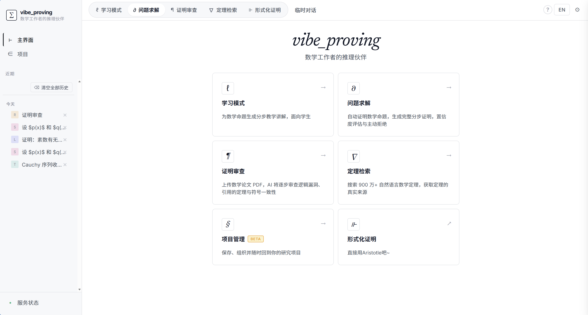
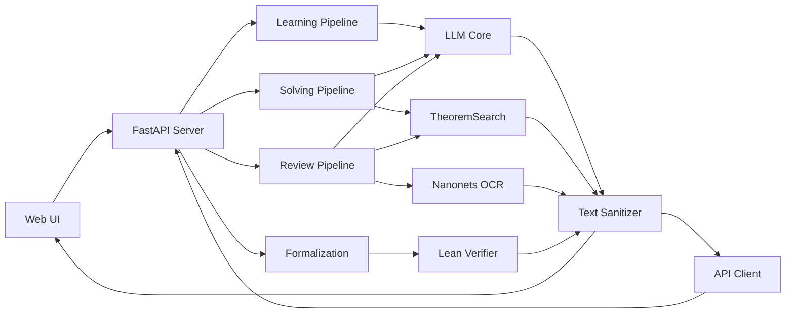

<div align="center">


<h3>AI-Powered Mathematical Reasoning Companion</h3>

[](LICENSE)
[](https://www.python.org/downloads/)
[](https://fastapi.tiangolo.com)

[English](#english) | [中文](#中文)

</div>

---

## 中文

**vibe_proving** 是一个面向数学学习、研究与证明验证的多模式 AI 系统。它将前沿的大语言模型与数学形式化工具结合，为数学工作者提供从学习到研究、从验证到形式化的全流程 AI 辅助。

### ✨ 核心能力

- **📚 学习模式** — 为任意数学命题生成分层讲解（前置知识、完整证明、例子、延伸阅读），支持本科/研究生两种难度
- **🔬 研究求解** — Generator–Verifier–Reviser 证明流水线，自动生成证明、核查定理引用、评估置信度，支持反例测试与主动拒绝
- **📝 证明审查** — 上传 PDF/LaTeX/图片，AI 自动审查逻辑漏洞、定理引用准确性、符号一致性，生成结构化报告
- **🔍 定理检索** — 搜索 900 万+ 自然语言数学定理（arXiv、Stacks Project 等），精准匹配相关引用
- **🔧 自动形式化** — 将自然语言数学命题转换为 Lean 4 代码，支持 Mathlib 检索、编译验证与自动修复（Beta）
- **💾 项目管理** — 创建独立研究项目，长期记忆会话历史，组织知识库

### 🎯 设计理念

不同于通用 AI 助手，vibe_proving 专注于数学场景的深度定制：

- **质控优先** — 内置 TheoremSearch 引用核查、反例测试、置信度评估，拒绝低质证明
- **工作流原生** — 5 种模式对应真实数学工作流（学习、求解、审查、检索、形式化）
- **流式交互** — SSE 实时推送进度与结果，支持大规模论文审查与长证明生成
- **开放集成** — 兼容 OpenAI API 格式的所有 LLM，可对接 DeepSeek、Gemini、Claude 等
- **本地优先** — 无强制云服务依赖，除 OCR 外所有功能可本地运行

### 🖼️ 界面预览

<div align="center">



*五大模式统一界面：学习、求解、审查、检索、形式化*

</div>

### 🚀 快速开始

#### 安装依赖

```bash
cd app
python -m venv .venv

# Windows
.venv\Scripts\activate

# macOS/Linux
source .venv/bin/activate

pip install -r requirements.txt
```

#### 配置 LLM

复制配置模板并填写 API Key：

```bash
cp config.example.toml config.toml
# 编辑 config.toml 填写 [llm] 区块的 api_key
```

或通过前端设置面板运行时配置（推荐）：

1. 启动服务后访问 `http://127.0.0.1:8080/ui/`
2. 点击右上角设置图标 ⚙️
3. 填写 LLM API 配置（Base URL + API Key + Model）

支持所有 OpenAI 兼容端点：

| 提供商 | Base URL | 获取密钥 |
|--------|----------|----------|
| **DeepSeek**（推荐：性价比） | `https://api.deepseek.com/v1` | [platform.deepseek.com](https://platform.deepseek.com/api_keys) |
| **Gemini**（推荐：推理能力） | `https://generativelanguage.googleapis.com/v1beta/openai` | [aistudio.google.com](https://aistudio.google.com/apikey) |
| OpenAI 官方 | `https://api.openai.com/v1` | [platform.openai.com](https://platform.openai.com/api-keys) |
| SiliconFlow | `https://api.siliconflow.cn/v1` | [cloud.siliconflow.cn](https://cloud.siliconflow.cn) |
| 通义千问 | `https://dashscope.aliyuncs.com/compatible-mode/v1` | [dashscope.aliyun.com](https://dashscope.aliyun.com) |

#### 启动服务

```bash
python -m uvicorn api.server:app --host 127.0.0.1 --port 8080
```

访问：
- 🌐 Web UI：`http://127.0.0.1:8080/ui/`
- 📖 API 文档：`http://127.0.0.1:8080/docs`
- ❤️ 健康检查：`http://127.0.0.1:8080/health`

### 📚 使用示例

#### 学习模式：分层讲解

```bash
curl -X POST http://127.0.0.1:8080/learn \
  -H "Content-Type: application/json" \
  -d '{
    "statement": "证明：素数有无穷多个",
    "level": "undergraduate",
    "lang": "zh"
  }'
```

返回包含背景、前置知识、完整证明、例子、延伸阅读的 Markdown 报告。

#### 研究求解：GVR 证明流水线

```bash
curl -X POST http://127.0.0.1:8080/solve \
  -H "Content-Type: application/json" \
  -d '{
    "statement": "证明：对于任意正整数 n，n^2 + n + 41 是素数"
  }'
```

系统会：
1. 🔍 搜索相关定理
2. 🤖 生成初始证明
3. 🧪 测试反例（发现 n=40 时不成立）
4. ✅ 返回 `verdict: counterexample` 与反例

#### 论文审查：PDF 结构化分析

```bash
curl -X POST http://127.0.0.1:8080/review_pdf_stream \
  -F "file=@paper.pdf" \
  -F "check_logic=true" \
  -F "check_citations=true" \
  -F "lang=zh"
```

逐条推送审查结果，标注逻辑漏洞、引用错误、符号不一致。

#### 定理检索：语义搜索

```bash
curl "http://127.0.0.1:8080/search?q=Cauchy序列收敛性&top_k=5"
```

返回最相关的 5 条定理，包含相似度、论文链接、定理陈述。

### 🏗️ 架构概览



- **前端**：原生 HTML/CSS/JS，Markdown + KaTeX 渲染
- **后端**：FastAPI + Pydantic，SSE 流式输出
- **LLM 层**：统一 OpenAI 接口，支持流式/非流式
- **质控层**：LaTeX 清洗、定理验证、反例测试
- **外部服务**：TheoremSearch（900万定理）、Nanonets OCR（PDF 解析）

### 🧪 测试

快速回归测试（跳过耗时集成测试）：

```bash
cd app
python -m pytest tests -m "not slow"
```

完整测试（需真实 API Key 与 PDF fixtures）：

```bash
python -m pytest tests -m slow
```

### 📖 API 文档

完整端点文档见 [OpenAPI Swagger UI](http://127.0.0.1:8080/docs)，主要端点：

| 端点 | 方法 | 功能 |
|------|------|------|
| `/learn` | POST | 生成分层教学讲解 |
| `/solve` | POST | GVR 证明流水线 |
| `/review_stream` | POST | 文本/图片审查（流式） |
| `/review_pdf_stream` | POST | PDF 审查（流式） |
| `/formalize` | POST | 自动形式化为 Lean 4 |
| `/search` | GET | TheoremSearch 定理检索 |
| `/health` | GET | 服务健康检查 |

详细参数说明见 [API 完整文档](#api-端点)。

### 🤝 贡献指南

我们欢迎所有形式的贡献！

- 🐛 **Bug 报告**：[提交 Issue](https://github.com/ml1301215/vibe-proving-math/issues)
- 💡 **功能建议**：描述使用场景与预期行为
- 📝 **代码贡献**：Fork 后提交 PR，遵循 [CLAUDE.md](CLAUDE.md) 编码约定
- 📚 **文档改进**：修正错误或补充示例

开发约定：
- Python 代码遵循 PEP 8，避免无意义注释
- 前端修改 `app.js` 后需递增 `index.html` 中的 `?v=` 版本号
- LaTeX 输出必须经过 `text_sanitize.py` 清洗
- 新增 API 端点需补充测试用例

### 📄 许可证

本项目采用 [MIT License](LICENSE) 授权。

### 🙏 致谢

设计与实现参考或集成了以下思路与生态：

- [TheoremSearch](https://www.theoremsearch.com) — 定理检索与引用核查
- [Aletheia](https://arxiv.org/abs/2602.10177) — Generator–Verifier–Reviser 范式
- [LATRACE](https://github.com/zxxz1000/LATRACE) — 长期记忆机制
- [Lean 4](https://lean-lang.org) 与 [Mathlib](https://leanprover-community.github.io) — 形式化验证

### 📞 联系方式

- **问题反馈**：[GitHub Issues](https://github.com/ml1301215/vibe-proving-math/issues)
- **项目主页**：[github.com/ml1301215/vibe-proving-math](https://github.com/ml1301215/vibe-proving-math)

---

## English

**vibe_proving** is a multi-mode AI system for mathematical learning, research, and proof verification. It combines cutting-edge large language models with formal math tools, providing end-to-end AI assistance for mathematicians—from learning to research, verification to formalization.

### ✨ Core Capabilities

- **📚 Learning Mode** — Generate layered explanations for any mathematical proposition (prerequisites, complete proof, examples, extensions) with undergraduate/graduate difficulty levels
- **🔬 Research Solving** — Generator–Verifier–Reviser proof pipeline with automatic proof generation, theorem citation checking, confidence assessment, counterexample testing, and active rejection
- **📝 Proof Review** — Upload PDF/LaTeX/images for automated logic gap detection, citation accuracy verification, symbol consistency checks, and structured reports
- **🔍 Theorem Search** — Search 9M+ natural language math theorems (arXiv, Stacks Project, etc.) with precise semantic matching
- **🔧 Auto-Formalization** — Convert natural language math statements to Lean 4 code, with Mathlib retrieval, compilation verification, and auto-repair (Beta)
- **💾 Project Management** — Create isolated research projects with long-term memory and knowledge base organization

### 🎯 Design Philosophy

Unlike general AI assistants, vibe_proving is deeply specialized for mathematical workflows:

- **Quality-First** — Built-in TheoremSearch citation checking, counterexample testing, confidence scoring; rejects low-quality proofs
- **Workflow-Native** — 5 modes mapping to real mathematical workflows (learn, solve, review, search, formalize)
- **Streaming UX** — SSE real-time progress and results, supporting large-scale paper review and long proof generation
- **Open Integration** — Compatible with all OpenAI-format LLMs: DeepSeek, Gemini, Claude, etc.
- **Local-First** — No mandatory cloud dependencies; all features except OCR can run locally

### 🖼️ UI Preview

<div align="center">


*Unified interface for five modes: Learn, Solve, Review, Search, Formalize*

</div>

### 🚀 Quick Start

#### Install Dependencies

```bash
cd app
python -m venv .venv

# Windows
.venv\Scripts\activate

# macOS/Linux
source .venv/bin/activate

pip install -r requirements.txt
```

#### Configure LLM

Copy the config template and fill in your API key:

```bash
cp config.example.toml config.toml
# Edit config.toml to fill [llm] section's api_key
```

Or configure at runtime via the frontend settings panel (recommended):

1. Start the service and visit `http://127.0.0.1:8080/ui/`
2. Click the settings icon ⚙️ in the top-right
3. Fill in LLM API Config (Base URL + API Key + Model)

Supports all OpenAI-compatible endpoints:

| Provider | Base URL | Get Key |
|----------|----------|---------|
| **DeepSeek** (Recommended: cost-effective) | `https://api.deepseek.com/v1` | [platform.deepseek.com](https://platform.deepseek.com/api_keys) |
| **Gemini** (Recommended: reasoning) | `https://generativelanguage.googleapis.com/v1beta/openai` | [aistudio.google.com](https://aistudio.google.com/apikey) |
| OpenAI Official | `https://api.openai.com/v1` | [platform.openai.com](https://platform.openai.com/api-keys) |
| SiliconFlow | `https://api.siliconflow.cn/v1` | [cloud.siliconflow.cn](https://cloud.siliconflow.cn) |
| Qwen (Tongyi) | `https://dashscope.aliyuncs.com/compatible-mode/v1` | [dashscope.aliyun.com](https://dashscope.aliyun.com) |

#### Start Service

```bash
python -m uvicorn api.server:app --host 127.0.0.1 --port 8080
```

Visit:
- 🌐 Web UI: `http://127.0.0.1:8080/ui/`
- 📖 API Docs: `http://127.0.0.1:8080/docs`
- ❤️ Health Check: `http://127.0.0.1:8080/health`

### 📚 Usage Examples

#### Learning Mode: Layered Explanation

```bash
curl -X POST http://127.0.0.1:8080/learn \
  -H "Content-Type: application/json" \
  -d '{
    "statement": "Prove: There are infinitely many primes",
    "level": "undergraduate",
    "lang": "en"
  }'
```

Returns a Markdown report with background, prerequisites, complete proof, examples, and extensions.

#### Research Solving: GVR Proof Pipeline

```bash
curl -X POST http://127.0.0.1:8080/solve \
  -H "Content-Type: application/json" \
  -d '{
    "statement": "Prove: For any positive integer n, n^2 + n + 41 is prime"
  }'
```

The system will:
1. 🔍 Search related theorems
2. 🤖 Generate initial proof
3. 🧪 Test counterexamples (finds n=40 fails)
4. ✅ Return `verdict: counterexample` with counterexample

#### Proof Review: PDF Structured Analysis

```bash
curl -X POST http://127.0.0.1:8080/review_pdf_stream \
  -F "file=@paper.pdf" \
  -F "check_logic=true" \
  -F "check_citations=true" \
  -F "lang=en"
```

Streams review results progressively, flagging logic gaps, citation errors, and symbol inconsistencies.

#### Theorem Search: Semantic Search

```bash
curl "http://127.0.0.1:8080/search?q=Cauchy+sequence+convergence&top_k=5"
```

Returns the 5 most relevant theorems with similarity scores, paper links, and theorem statements.

### 🏗️ Architecture Overview


- **Frontend**: Vanilla HTML/CSS/JS with Markdown + KaTeX rendering
- **Backend**: FastAPI + Pydantic with SSE streaming
- **LLM Layer**: Unified OpenAI interface, streaming/non-streaming
- **QC Layer**: LaTeX sanitization, theorem verification, counterexample testing
- **External Services**: TheoremSearch (9M theorems), Nanonets OCR (PDF parsing)

### 🧪 Testing

Fast regression (skips time-consuming integration tests):

```bash
cd app
python -m pytest tests -m "not slow"
```

Full test suite (requires real API keys and PDF fixtures):

```bash
python -m pytest tests -m slow
```

### 📖 API Documentation

Full endpoint docs at [OpenAPI Swagger UI](http://127.0.0.1:8080/docs). Main endpoints:

| Endpoint | Method | Function |
|----------|--------|----------|
| `/learn` | POST | Generate layered explanations |
| `/solve` | POST | GVR proof pipeline |
| `/review_stream` | POST | Text/image review (streaming) |
| `/review_pdf_stream` | POST | PDF review (streaming) |
| `/formalize` | POST | Auto-formalize to Lean 4 |
| `/search` | GET | TheoremSearch theorem retrieval |
| `/health` | GET | Service health check |

See the [full API section](#api-端点) for detailed parameters.

### 🤝 Contributing

We welcome all forms of contribution!

- 🐛 **Bug Reports**: [Submit Issue](https://github.com/ml1301215/vibe-proving-math/issues)
- 💡 **Feature Requests**: Describe use case and expected behavior
- 📝 **Code Contributions**: Fork and submit PR, follow [CLAUDE.md](CLAUDE.md) conventions
- 📚 **Docs Improvements**: Fix errors or add examples

Development conventions:
- Python code follows PEP 8, avoid meaningless comments
- After editing `app.js`, increment the `?v=` version in `index.html`
- LaTeX output must pass through `text_sanitize.py`
- New API endpoints require test coverage

### 📄 License

This project is licensed under the [MIT License](LICENSE).

### 🙏 Acknowledgments

Design and implementation reference or integrate ideas from:

- [TheoremSearch](https://www.theoremsearch.com) — Theorem search and citation checking
- [Aletheia](https://arxiv.org/abs/2602.10177) — Generator–Verifier–Reviser paradigm
- [LATRACE](https://github.com/zxxz1000/LATRACE) — Long-term memory mechanism
- [Lean 4](https://lean-lang.org) & [Mathlib](https://leanprover-community.github.io) — Formal verification

### 📞 Contact

- **Issue Tracking**: [GitHub Issues](https://github.com/ml1301215/vibe-proving-math/issues)
- **Project Home**: [github.com/ml1301215/vibe-proving-math](https://github.com/ml1301215/vibe-proving-math)

---

## API 端点

完整 OpenAPI 文档见 `GET /docs`（Swagger UI）。以下为各端点速查。

### 学习模式

#### `POST /learn`

为数学命题生成分层教学讲解（背景 / 前置知识 / 完整证明 / 例子 / 延伸阅读）。

**请求体（JSON）：**

| 字段 | 类型 | 默认值 | 说明 |
|------|------|--------|------|
| `statement` | `string` | 必填 | 数学命题，≤ 10 000 字符 |
| `level` | `string` | `"undergraduate"` | `"undergraduate"` \| `"graduate"` |
| `stream` | `bool` | `true` | 为 `true` 时返回 SSE 流；`false` 返回完整 JSON |
| `lang` | `string` | `null` | `"zh"` 强制中文输出 |
| `model` | `string` | `null` | 覆盖默认 LLM（OpenRouter 模型 ID） |
| `project_id` | `string` | `"default"` | 关联记忆项目 |
| `user_id` | `string` | `"anonymous"` | 用户标识（用于记忆隔离） |

**SSE 帧（`stream=true`）：** `{"chunk":"..."}` 正文 Markdown 片段；`{"status":"...","step":"..."}` 阶段进度；`[DONE]` 结束。

**JSON 响应（`stream=false`）：** `{"markdown": "...", "has_all_sections": true}`

---

#### `POST /learn/section`

单卡重生成：只重新生成学习报告中的某一个 section（SSE 流式）。

**请求体（JSON）：**

| 字段 | 类型 | 默认值 | 说明 |
|------|------|--------|------|
| `statement` | `string` | 必填 | 原始命题 |
| `section` | `string` | 必填 | `"background"` \| `"prereq"` \| `"proof"` \| `"examples"` \| `"extensions"` |
| `level` | `string` | `"undergraduate"` | 同 `/learn` |
| `lang` | `string` | `null` | 同 `/learn` |
| `model` | `string` | `null` | 同 `/learn` |

---

### 研究求解

#### `POST /solve`

GVR（Generator–Verifier–Reviser）证明 pipeline，含 TheoremSearch 引用核查、反例测试与子目标分解。

**请求体（JSON）：**

| 字段 | 类型 | 默认值 | 说明 |
|------|------|--------|------|
| `statement` | `string` | 必填 | 待证命题，≤ 10 000 字符 |
| `stream` | `bool` | `true` | SSE 或 JSON |
| `model` | `string` | `null` | 覆盖 LLM |
| `project_id` | `string` | `"default"` | 项目标识 |
| `user_id` | `string` | `"anonymous"` | 用户标识 |

**JSON 响应（`stream=false`）：**

```json
{
  "blueprint": "## 完整证明\n\n...",
  "references": [{"name":"...", "status":"verified", "similarity":0.85, "link":"..."}],
  "confidence": 0.83,
  "verdict": "proved | partial | counterexample | No confident solution | direct_hit",
  "obstacles": ["..."],
  "subgoals": [...],
  "verification": {"overall":"passed", "goal_reached":true, "steps":[...]},
  "failed_paths": ["..."]
}
```

**SSE 帧（`stream=true`）：** 进度帧 `{"status":"...","step":"search|proving|counterexample|decomposing|verifying|done"}`，完成后推送 Markdown 正文（含置信度与引用核查摘要）。

---

### 论文审查

#### `POST /review`

文本 / 图片输入，同步返回完整 JSON 审查报告（不推荐长文本，建议用流式端点）。

**请求体（JSON）：**

| 字段 | 类型 | 默认值 | 说明 |
|------|------|--------|------|
| `proof_text` | `string` | `""` | LaTeX / Markdown 证明文本，≤ 50 000 字符 |
| `images` | `string[]` | `null` | Base64 data URL 图片列表（与 `proof_text` 二选一或并用） |
| `max_theorems` | `int` | `8` | 最多审查的定理数 |
| `check_logic` | `bool` | `true` | 是否审查逻辑漏洞 |
| `check_citations` | `bool` | `true` | 是否核查定理引用（TheoremSearch） |
| `check_symbols` | `bool` | `true` | 是否检查符号一致性 |
| `lang` | `string` | `null` | 输出语言 |
| `model` | `string` | `null` | 覆盖 LLM |

---

#### `POST /review_stream`

同 `/review`，SSE 流式输出，逐条推送各定理审查结果。

**SSE 帧类型：**

| 帧 | 含义 |
|----|------|
| `{"status":"...","step":"..."}` | 阶段进度 |
| `{"result":{"kind":"theorem","index":N,"data":{...}}}` | 单条定理审查结果（逐步推送） |
| `{"final":{...}}` | 最终汇总报告 |
| `[DONE]` | 结束 |

---

#### `POST /review_pdf_stream`

PDF / 图片 / LaTeX 文件上传审查（multipart/form-data），SSE 流式。

**表单字段：**

| 字段 | 类型 | 默认值 | 说明 |
|------|------|--------|------|
| `file` | `file` | 必填 | `.pdf` / `.png` / `.jpg` / `.tex` / `.txt` / `.md` |
| `max_theorems` | `int` | `8` | 最多审查定理数（非 PDF 路径有效） |
| `check_logic` | `bool` | `true` | 逻辑审查 |
| `check_citations` | `bool` | `true` | 引用核查 |
| `check_symbols` | `bool` | `true` | 符号一致性 |
| `nanonets_api_key` | `string` | `null` | 覆盖 Nanonets OCR Key（PDF 路径） |
| `lang` | `string` | `null` | 输出语言 |
| `model` | `string` | `null` | 覆盖 LLM |

> PDF 文件会通过 Nanonets OCR 提取文本，再按章节切分进行结构化审查。

---

### 自动形式化

#### `POST /formalize`

将自然语言数学命题形式化为 Lean 4 代码（Beta），SSE 流式。

**请求体（JSON）：**

| 字段 | 类型 | 默认值 | 说明 |
|------|------|--------|------|
| `statement` | `string` | 必填 | 待形式化的数学命题 |
| `mode` | `string` | `"aristotle"` | `"aristotle"`（Harmonic Aristotle API）\| `"pipeline"`（本地 LLM + 验证） |
| `lang` | `string` | `"zh"` | 提示语言 |
| `max_iters` | `int` | `4` | `pipeline` 模式最大迭代修复轮次 |
| `current_code` | `string` | `null` | 已有 Lean 代码（用于增量修复） |
| `compile_error` | `string` | `null` | 上轮编译错误（用于增量修复） |
| `skip_search` | `bool` | `false` | 跳过 Mathlib 关键词检索 |
| `model` | `string` | `null` | 覆盖 LLM |

---

#### `GET /formalize/status/{job_id}`

查询 Harmonic Aristotle 形式化任务状态。

**路径参数：** `job_id` —— `/formalize`（Aristotle 模式）返回的 `project_id`。

**响应：**

```json
{
  "project_id": "...",
  "status": "pending | running | completed | failed",
  "percent_complete": 75,
  "created_at": "...",
  "last_updated_at": "...",
  "output_summary": "...",
  "cached": null
}
```

---

### 工具端点

#### `GET /search`

TheoremSearch 透传，搜索 900 万+ 自然语言数学定理（arXiv、Stacks Project 等）。

**查询参数：**

| 参数 | 类型 | 默认值 | 说明 |
|------|------|--------|------|
| `q` | `string` | 必填 | 搜索词（自然语言或数学表达式） |
| `top_k` | `int` | `10` | 返回条数（1–50） |
| `min_similarity` | `float` | `0.0` | 最低相似度阈值（0.0–1.0） |

**响应：** `{"query":"...","count":N,"results":[{"name":"...","body":"...","similarity":0.85,"link":"...",...}]}`

---

#### `POST /projects`

创建记忆隔离项目（学习模式长期记忆的命名空间，MVP 阶段内存存储）。

**请求体（JSON）：** `{"project_id":"p1","name":"代数拓扑笔记","description":"...","user_id":"alice"}`

#### `GET /projects`

列出用户的所有项目。**查询参数：** `user_id`（默认 `"anonymous"`）。

---

#### `GET /health`

服务健康检查，并发探活 LATRACE、TheoremSearch、Kimina 验证器、Aristotle。

**响应字段：** `status`（`"ok"` / `"degraded"`）、`version`、`timestamp`、`llm`（当前模型信息）、`dependencies`（各依赖详情与缓存统计）。

---

### 配置端点

#### `POST /config/llm`

运行时更新 LLM 配置（Base URL、API Key、Model）。

**请求体（JSON）：**

```json
{
  "base_url": "https://api.deepseek.com/v1",
  "api_key": "sk-...",
  "model": "deepseek-chat"
}
```

#### `POST /config/nanonets`

运行时更新 Nanonets OCR API Key。

**请求体（JSON）：**

```json
{
  "api_key": "your-nanonets-key"
}
```

---

### 其他

| 方法 | 路径 | 说明 |
|------|------|------|
| GET | `/docs` | OpenAPI Swagger UI（自动生成） |
| GET | `/ui/` | 单页前端（静态托管） |
| GET | `/` | 重定向至 `/ui/` |
