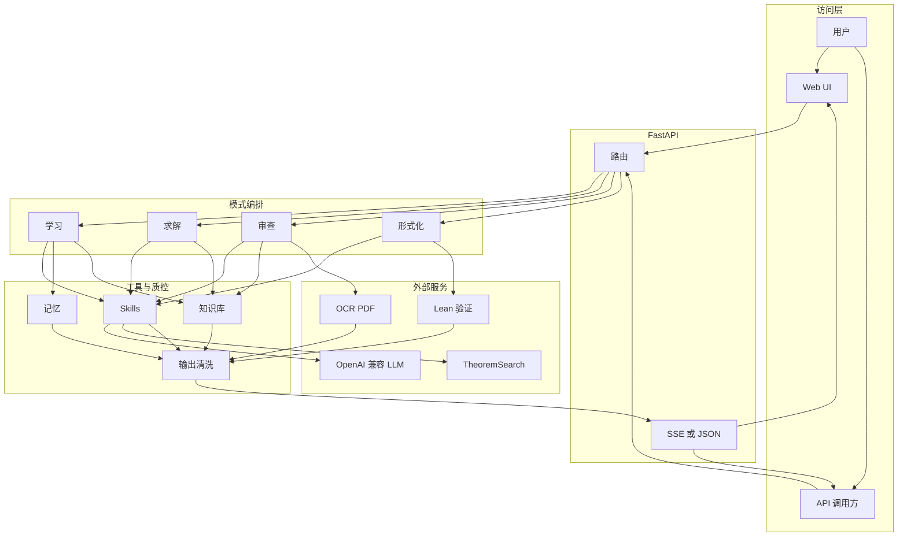

# vibe_proving

面向数学学习、研究与证明验证的多模式 AI 系统：分层讲解、生成–验证–修订式求解、论文与证明审查、定理检索，以及 Lean/mathlib 自动形式化（Beta）。

更完整的产品视角说明见 [PRODUCT_INTRO.md](PRODUCT_INTRO.md)。开发者约定见 [CLAUDE.md](CLAUDE.md)。

## 能力一览

| 能力 | 说明 |
|------|------|
| 学习模式 | 前置知识、分层证明讲解、例子与延伸 |
| 研究求解 | Generator–Verifier–Reviser；TheoremSearch 引用核查；反例与主动拒绝 |
| 论文审查 | 文本 / LaTeX / 图片 / PDF；逻辑、引用、符号一致性；SSE 流式 |
| 自动形式化 | 自然语言 → Lean；检索、蓝图、生成、验证与修复（Beta） |
| 定理检索 | `GET /search` 对接 TheoremSearch |
| 知识库 | 本地文档分块与 BM25 式检索（无强制向量库） |

## 架构（概览）



## API 端点

完整 OpenAPI 文档见 `GET /docs`（Swagger UI）。以下为各端点速查。

---

### 学习模式

#### `POST /learn`

为数学命题生成分层教学讲解（背景 / 前置知识 / 完整证明 / 例子 / 延伸阅读）。

**请求体（JSON）：**

| 字段 | 类型 | 默认值 | 说明 |
|------|------|--------|------|
| `statement` | `string` | 必填 | 数学命题，≤ 10 000 字符 |
| `level` | `string` | `"undergraduate"` | `"undergraduate"` \| `"graduate"` |
| `stream` | `bool` | `true` | 为 `true` 时返回 SSE 流；`false` 返回完整 JSON |
| `lang` | `string` | `null` | `"zh"` 强制中文输出 |
| `model` | `string` | `null` | 覆盖默认 LLM（OpenRouter 模型 ID） |
| `project_id` | `string` | `"default"` | 关联记忆项目 |
| `user_id` | `string` | `"anonymous"` | 用户标识（用于记忆隔离） |

**SSE 帧（`stream=true`）：** `{"chunk":"..."}` 正文 Markdown 片段；`{"status":"...","step":"..."}` 阶段进度；`[DONE]` 结束。

**JSON 响应（`stream=false`）：** `{"markdown": "...", "has_all_sections": true}`

---

#### `POST /learn/section`

单卡重生成：只重新生成学习报告中的某一个 section（SSE 流式）。

**请求体（JSON）：**

| 字段 | 类型 | 默认值 | 说明 |
|------|------|--------|------|
| `statement` | `string` | 必填 | 原始命题 |
| `section` | `string` | 必填 | `"background"` \| `"prereq"` \| `"proof"` \| `"examples"` \| `"extensions"` |
| `level` | `string` | `"undergraduate"` | 同 `/learn` |
| `lang` | `string` | `null` | 同 `/learn` |
| `model` | `string` | `null` | 同 `/learn` |

---

### 研究求解

#### `POST /solve`

GVR（Generator–Verifier–Reviser）证明 pipeline，含 TheoremSearch 引用核查、反例测试与子目标分解。

**请求体（JSON）：**

| 字段 | 类型 | 默认值 | 说明 |
|------|------|--------|------|
| `statement` | `string` | 必填 | 待证命题，≤ 10 000 字符 |
| `stream` | `bool` | `true` | SSE 或 JSON |
| `model` | `string` | `null` | 覆盖 LLM |
| `project_id` | `string` | `"default"` | 项目标识 |
| `user_id` | `string` | `"anonymous"` | 用户标识 |

**JSON 响应（`stream=false`）：**

```json
{
  "blueprint": "## 完整证明\n\n...",
  "references": [{"name":"...", "status":"verified", "similarity":0.85, "link":"..."}],
  "confidence": 0.83,
  "verdict": "proved | partial | counterexample | No confident solution | direct_hit",
  "obstacles": ["..."],
  "subgoals": [...],
  "verification": {"overall":"passed", "goal_reached":true, "steps":[...]},
  "failed_paths": ["..."]
}
```

**SSE 帧（`stream=true`）：** 进度帧 `{"status":"...","step":"search|proving|counterexample|decomposing|verifying|done"}`，完成后推送 Markdown 正文（含置信度与引用核查摘要）。

---

### 论文审查

#### `POST /review`

文本 / 图片输入，同步返回完整 JSON 审查报告（不推荐长文本，建议用流式端点）。

**请求体（JSON）：**

| 字段 | 类型 | 默认值 | 说明 |
|------|------|--------|------|
| `proof_text` | `string` | `""` | LaTeX / Markdown 证明文本，≤ 50 000 字符 |
| `images` | `string[]` | `null` | Base64 data URL 图片列表（与 `proof_text` 二选一或并用） |
| `max_theorems` | `int` | `8` | 最多审查的定理数 |
| `check_logic` | `bool` | `true` | 是否审查逻辑漏洞 |
| `check_citations` | `bool` | `true` | 是否核查定理引用（TheoremSearch） |
| `check_symbols` | `bool` | `true` | 是否检查符号一致性 |
| `lang` | `string` | `null` | 输出语言 |
| `model` | `string` | `null` | 覆盖 LLM |

---

#### `POST /review_stream`

同 `/review`，SSE 流式输出，逐条推送各定理审查结果。

**SSE 帧类型：**

| 帧 | 含义 |
|----|------|
| `{"status":"...","step":"..."}` | 阶段进度 |
| `{"result":{"kind":"theorem","index":N,"data":{...}}}` | 单条定理审查结果（逐步推送） |
| `{"final":{...}}` | 最终汇总报告 |
| `[DONE]` | 结束 |

---

#### `POST /review_pdf_stream`

PDF / 图片 / LaTeX 文件上传审查（multipart/form-data），SSE 流式。

**表单字段：**

| 字段 | 类型 | 默认值 | 说明 |
|------|------|--------|------|
| `file` | `file` | 必填 | `.pdf` / `.png` / `.jpg` / `.tex` / `.txt` / `.md` |
| `max_theorems` | `int` | `8` | 最多审查定理数（非 PDF 路径有效） |
| `check_logic` | `bool` | `true` | 逻辑审查 |
| `check_citations` | `bool` | `true` | 引用核查 |
| `check_symbols` | `bool` | `true` | 符号一致性 |
| `nanonets_api_key` | `string` | `null` | 覆盖 Nanonets OCR Key（PDF 路径） |
| `lang` | `string` | `null` | 输出语言 |
| `model` | `string` | `null` | 覆盖 LLM |

> PDF 文件会通过 Nanonets OCR 提取文本，再按章节切分进行结构化审查。

---

### 自动形式化

#### `POST /formalize`

将自然语言数学命题形式化为 Lean 4 代码（Beta），SSE 流式。

**请求体（JSON）：**

| 字段 | 类型 | 默认值 | 说明 |
|------|------|--------|------|
| `statement` | `string` | 必填 | 待形式化的数学命题 |
| `mode` | `string` | `"aristotle"` | `"aristotle"`（Harmonic Aristotle API）\| `"pipeline"`（本地 LLM + 验证） |
| `lang` | `string` | `"zh"` | 提示语言 |
| `max_iters` | `int` | `4` | `pipeline` 模式最大迭代修复轮次 |
| `current_code` | `string` | `null` | 已有 Lean 代码（用于增量修复） |
| `compile_error` | `string` | `null` | 上轮编译错误（用于增量修复） |
| `skip_search` | `bool` | `false` | 跳过 Mathlib 关键词检索 |
| `model` | `string` | `null` | 覆盖 LLM |

---

#### `GET /formalize/status/{job_id}`

查询 Harmonic Aristotle 形式化任务状态。

**路径参数：** `job_id` —— `/formalize`（Aristotle 模式）返回的 `project_id`。

**响应：**

```json
{
  "project_id": "...",
  "status": "pending | running | completed | failed",
  "percent_complete": 75,
  "created_at": "...",
  "last_updated_at": "...",
  "output_summary": "...",
  "cached": null
}
```

---

### 工具端点

#### `GET /search`

TheoremSearch 透传，搜索 900 万+ 自然语言数学定理（arXiv、Stacks Project 等）。

**查询参数：**

| 参数 | 类型 | 默认值 | 说明 |
|------|------|--------|------|
| `q` | `string` | 必填 | 搜索词（自然语言或数学表达式） |
| `top_k` | `int` | `10` | 返回条数（1–50） |
| `min_similarity` | `float` | `0.0` | 最低相似度阈值（0.0–1.0） |

**响应：** `{"query":"...","count":N,"results":[{"name":"...","body":"...","similarity":0.85,"link":"...",...}]}`

---

#### `POST /projects`

创建记忆隔离项目（学习模式长期记忆的命名空间，MVP 阶段内存存储）。

**请求体（JSON）：** `{"project_id":"p1","name":"代数拓扑笔记","description":"...","user_id":"alice"}`

#### `GET /projects`

列出用户的所有项目。**查询参数：** `user_id`（默认 `"anonymous"`）。

---

#### `GET /health`

服务健康检查，并发探活 LATRACE、TheoremSearch、Kimina 验证器、Aristotle。

**响应字段：** `status`（`"ok"` / `"degraded"`）、`version`、`timestamp`、`llm`（当前模型信息）、`dependencies`（各依赖详情与缓存统计）。

---

### 其他

| 方法 | 路径 | 说明 |
|------|------|------|
| GET | `/docs` | OpenAPI Swagger UI（自动生成） |
| GET | `/ui/` | 单页前端（静态托管） |
| GET | `/` | 重定向至 `/ui/` |

## 快速开始

```bash
cd app
python -m venv .venv
# Windows: .venv\Scripts\activate
# Unix:    source .venv/bin/activate
pip install -r requirements.txt
cp config.example.toml config.toml
# 编辑 config.toml：至少填写 [llm].api_key；按需填写定理检索、OCR、记忆等
python -m uvicorn api.server:app --host 127.0.0.1 --port 8080
```

访问：`http://127.0.0.1:8080/ui/`、`http://127.0.0.1:8080/docs`、`http://127.0.0.1:8080/health`。

### 配置文件路径

- 默认读取 `app/config.toml`（已被 `.gitignore` 忽略，勿提交）。
- 可通过环境变量 `VP_CONFIG_PATH` 指向任意路径的 TOML。
- 测试在未找到 `config.toml` 时会自动从 `config.example.toml` 复制到临时文件并设置 `VP_CONFIG_PATH`。

## 测试

```bash
cd app
python -m pytest tests -m "not slow"
```

完整集成（真实 API / OCR / PDF fixtures）：

```bash
python -m pytest tests -m slow
```

论文 PDF fixture 不包含在仓库中，见 [app/tests/fixtures/paper_review_pdfs/README.md](app/tests/fixtures/paper_review_pdfs/README.md)。

## 仓库结构

| 路径 | 说明 |
|------|------|
| `app/` | 应用代码、前端、测试 |
| `research/` | 设计与调研文档 |
| `PRODUCT_INTRO.md` | 产品介绍与功能流程图 |
| `LICENSE` | MIT |

以下目录**不包含**在公开仓库中（见 `.gitignore`）：`FATE/`、`Archon/`、`Rethlas/`、本地 Lean 环境、评估产物、含密钥的 `app/config.toml`。

## 安全与密钥

- **切勿**将真实 `api_key`、`token` 提交到 git。
- 若曾在本地提交过密钥，请在对应平台**吊销并轮换**，再使用本仓库的干净历史分支推送到 GitHub。

## 致谢与参考

设计与实现参考或集成了以下思路与生态（详见 `research/`）：

- [TheoremSearch](https://www.theoremsearch.com) — 定理检索与引用核查
- Aletheia（arXiv:2602.10177）— Generator–Verifier–Reviser
- [LATRACE](https://github.com/zxxz1000/LATRACE) — 可选长期记忆
- [Rethlas](https://github.com/frenzymath/Rethlas)、[Archon](https://github.com/frenzymath/Archon) — 架构启发（本仓库不包含其源码）

## 协议

本项目以 [LICENSE](LICENSE)（MIT）授权。

## 推送到 GitHub（仅公开干净历史）

本仓库的 **`public/main`** 分支为 orphan 根提交（`chore: initial public release`），不含旧历史中可能泄漏的密钥。推送时**只推该分支**到远端默认分支即可：

```bash
git remote add origin https://github.com/<org>/<repo>.git   # 若尚未添加
git push -u origin public/main:main
```

本地仍保留旧分支与对象时，请勿执行 `git push --mirror` 或推送整个 `.git` 到公开位置。若曾在旧提交中使用过真实 API Key / Token，请到各服务商控制台**吊销并轮换**。
