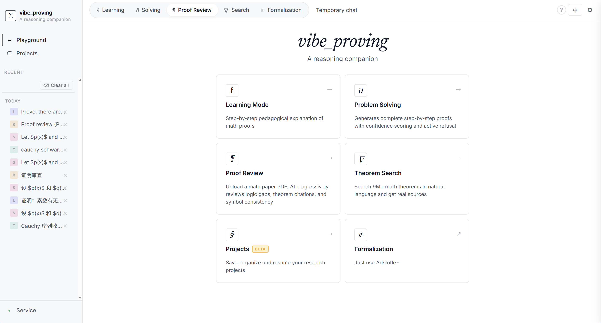

<p align="center">
AI-driven mathematical research assistant for students and researchers
</p>

<p align="center">
<a href="LICENSE"></a>
<a href="https://www.python.org/downloads/"></a>
</p>

<p align="center">
<a href="README.zh.md">中文</a> | English
</p>

---

## Overview

**vibe_proving** is an AI platform designed for students and researchers in mathematics. It combines language models with theorem retrieval to provide interactive workflows for learning, problem-solving, proof review, and knowledge discovery.

### Core Capabilities

- **Learning Mode** — Generate structured explanations with prerequisites, proofs, examples, and extensions
- **Solving Mode** — Automated proof generation with citation verification and confidence scoring
- **Review Mode** — Structured analysis of mathematical writing (LaTeX/PDF/images)
- **Search Mode** — Semantic search across 9M+ theorems from arXiv and mathematical databases



### Video Demonstrations

<table>
<tr>
<td width="50%" align="center">

**Learning Mode**  
[](https://github.com/user-attachments/assets/ff33ef0e-b330-4d79-bb06-3a0c4cd9f920)  
*Click to play video*

</td>
<td width="50%" align="center">

**Problem Solving**  
[](https://github.com/user-attachments/assets/ce5e17b3-e9e9-45ce-a038-c2b6b672d440)  
*Click to play video*

</td>
</tr>
<tr>
<td width="50%" align="center">

**Proof Review**  
[](https://github.com/user-attachments/assets/eec047a3-c791-4938-a4fc-5e322ccfb2da)  
*Click to play video*

</td>
<td width="50%" align="center">

**Literature Search**  
[](https://github.com/user-attachments/assets/588b3f73-7b4f-4040-acd2-d7243c10b3dc)  
*Click to play video*

</td>
</tr>
<tr>
<td width="50%" align="center">

**Formalization**  
[](https://github.com/user-attachments/assets/3dd05428-e023-4903-bb6b-0cc2e7dad42c)  
*Click to play video*

</td>
<td width="50%">

</td>
</tr>
</table>

---

## Key Features

### 1. Interactive Learning

Transform mathematical statements into comprehensive learning resources:
- Background context and motivation
- Prerequisite knowledge with definitions
- Step-by-step proof walkthrough
- Concrete examples and counterexamples
- Extensions and related topics

Target difficulty levels: undergraduate or graduate.

### 2. Intelligent Problem Solving

Generator–Verifier–Reviser pipeline:
- Direct retrieval from theorem databases
- Proof generation with reasoning steps
- Independent verification
- Citation checking via [TheoremSearch](https://www.theoremsearch.com)
- Counterexample testing
- Confidence scoring with explicit uncertainty

### 3. Proof Review

Automated analysis:
- **Logic Consistency**: Detect missing steps, circular reasoning
- **Citation Accuracy**: Verify referenced theorems
- **Symbol Consistency**: Track variable scope

Supported formats: Text, LaTeX, images (via vision models), PDF (via OCR).

### 4. Theorem Discovery

Semantic search:
- 9M+ theorems from arXiv, Stacks Project, and specialized databases
- Natural language queries
- Similarity ranking
- Direct links to papers

### 5. Formalization

Natural language to Lean 4 translation:
- Keyword extraction and Mathlib retrieval
- Blueprint planning
- Code generation with automated repair

---

## Installation

**Requirements:** Python 3.11 or higher

### Linux / macOS

```bash
git clone https://github.com/ml1301215/vibe-proving-math.git
cd vibe-proving-math/app
python3 -m venv .venv
source .venv/bin/activate
pip install -r requirements.txt
cp config.example.toml config.toml
python -m uvicorn api.server:app --host 127.0.0.1 --port 8080
```

### Windows (PowerShell)

```powershell
git clone https://github.com/ml1301215/vibe-proving-math.git
cd vibe-proving-math\app
python -m venv .venv
.venv\Scripts\Activate.ps1
pip install -r requirements.txt
copy config.example.toml config.toml
python -m uvicorn api.server:app --host 127.0.0.1 --port 8080
```

### Windows (Command Prompt)

```cmd
git clone https://github.com/ml1301215/vibe-proving-math.git
cd vibe-proving-math\app
python -m venv .venv
.venv\Scripts\activate.bat
pip install -r requirements.txt
copy config.example.toml config.toml
python -m uvicorn api.server:app --host 127.0.0.1 --port 8080
```

**Open `http://127.0.0.1:8080/ui/` in your browser.**

Click the **settings icon (⚙️)** in the top-right corner to configure:
- LLM API (Base URL, API Key, Model)
- Nanonets OCR (for PDF review)

All API keys can be configured through the web interface — no need to edit config.toml manually.

---

## Architecture

```
┌────────────────────────────────────────────────┐
│              Web Interface                     │
│      (Vanilla JS + KaTeX + SSE Streaming)      │
└───────────────────┬────────────────────────────┘
                    │
       ┌────────────▼────────────┐
       │   FastAPI Server        │
       │   (Python 3.10+)        │
       └────────────┬────────────┘
                    │
    ┌───────────────┼───────────────┐
    │               │               │
┌───▼────┐   ┌─────▼──────┐   ┌───▼────┐
│Learning│   │  Solving   │   │ Review │
│Pipeline│   │  Pipeline  │   │Pipeline│
└───┬────┘   └─────┬──────┘   └───┬────┘
    │              │              │
    └──────────────┼──────────────┘
                   │
    ┌──────────────┼──────────────┐
    │              │              │
┌───▼──────┐  ┌───▼────────┐  ┌─▼────────┐
│ LLM Core │  │  Theorem   │  │ Nanonets │
│ (OpenAI  │  │  Search    │  │   OCR    │
│   API)   │  │ (Citation) │  │  (PDF)   │
└──────────┘  └────────────┘  └──────────┘
```

**Key Components**:

- **Frontend**: Single-page application with Markdown + KaTeX rendering
- **Backend**: FastAPI with Server-Sent Events for progressive streaming
- **LLM Integration**: OpenAI-compatible interface (DeepSeek, Gemini, OpenAI, etc.)
- **Citation Verification**: TheoremSearch API integration
- **PDF Processing**: Nanonets OCR for formula-preserving extraction

---

## API Reference

Complete documentation at `/docs`. Core endpoints:

| Endpoint | Method | Purpose |
|----------|--------|---------|
| `/learn` | POST | Generate structured explanations |
| `/learn/section` | POST | Regenerate specific section |
| `/solve` | POST | Proof generation with verification |
| `/solve_latex` | POST | Generate LaTeX from proof blueprint |
| `/review` | POST | Text/image proof review |
| `/review_stream` | POST | Streaming proof review |
| `/review_pdf_stream` | POST | PDF upload and analysis |
| `/formalize` | POST | Natural language → Lean 4 |
| `/search` | GET | Theorem semantic search |
| `/config/llm` | POST | Runtime LLM configuration |
| `/config/nanonets` | POST | Runtime OCR configuration |

**Example** (Solving mode):

```bash
curl -X POST http://127.0.0.1:8080/solve \
  -H "Content-Type: application/json" \
  -d '{
    "statement": "Prove: For all primes p > 2, p is odd"
  }'
```

---

## Use Cases

### For Students

- **Concept Exploration**: Input unfamiliar theorems to receive prerequisite breakdowns
- **Proof Understanding**: Step-by-step walkthroughs with reasoning annotations
- **Exam Preparation**: Generate practice problems and worked examples

### For Researchers

- **Literature Review**: Semantic search across theorem databases
- **Proof Drafting**: Generate initial proof sketches with citation suggestions
- **Manuscript Review**: Automated consistency checking before submission

---

## Contributing

We welcome contributions from the mathematical community:

- **Bug Reports**: [GitHub Issues](https://github.com/ml1301215/vibe-proving-math/issues)
- **Feature Requests**: Describe use cases and expected behavior
- **Code Contributions**: Follow conventions in [CLAUDE.md](CLAUDE.md)
- **Documentation**: Improve examples, fix errors, translate content

---

## Acknowledgments

- [TheoremSearch](https://www.theoremsearch.com) — Semantic theorem database
- [Aletheia](https://arxiv.org/abs/2602.10177) — Generator–Verifier–Reviser architecture
- [Rethlas](https://github.com/frenzymath/Rethlas) — Natural-language reasoning system with generation and verification agents
- [LATRACE](https://github.com/zxxz1000/LATRACE) — Long-term memory system
- [Nanonets OCR](https://nanonets.com) — Formula-aware PDF extraction
- [Harmonic Aristotle](https://aristotle.harmonic.fun) — Lean 4 formalization engine
- [Research Math Assistant](https://github.com/ml1301215/research-math-assistant) — Community resources

---

## License

[MIT License](LICENSE)

---

## Contact

**QQ Group**: 1093249787  
**GitHub Issues**: [github.com/ml1301215/vibe-proving-math/issues](https://github.com/ml1301215/vibe-proving-math/issues)
