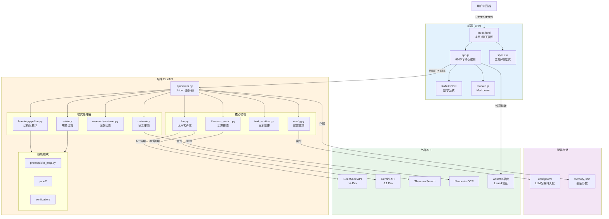
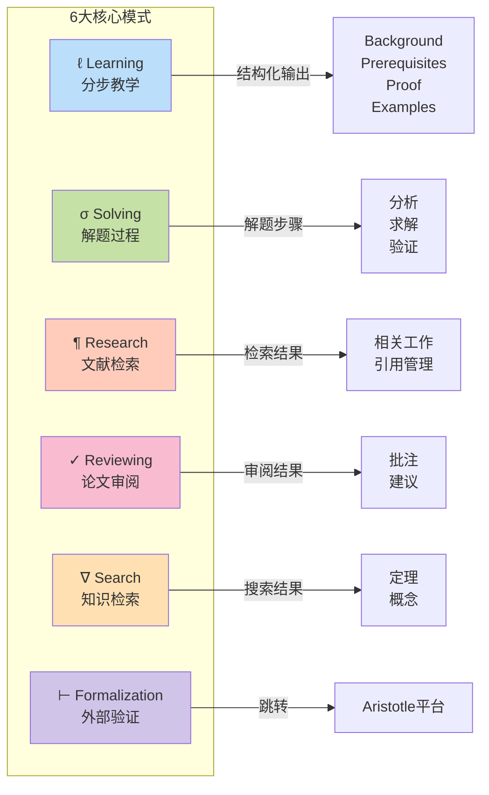
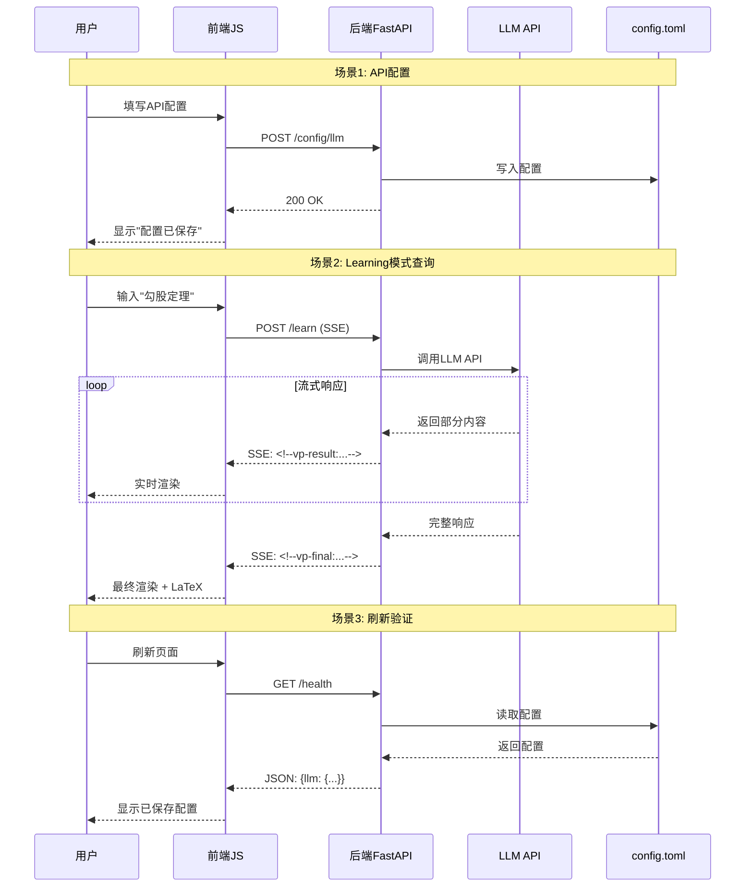
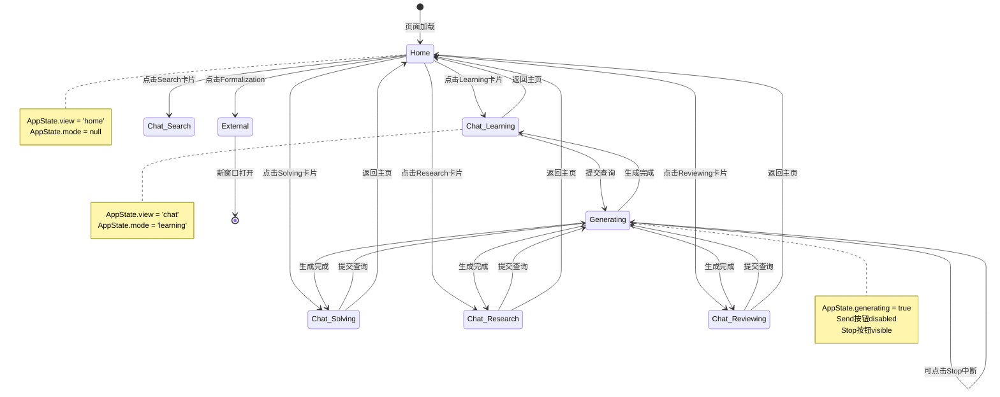
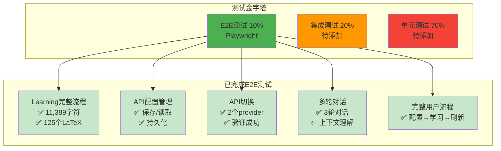
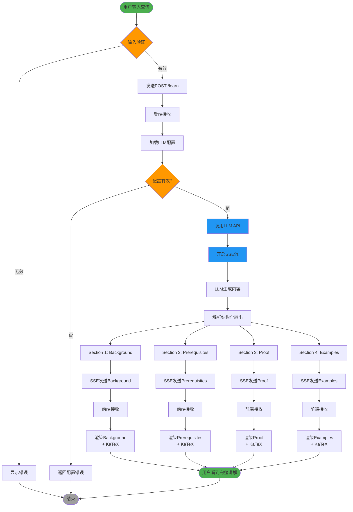
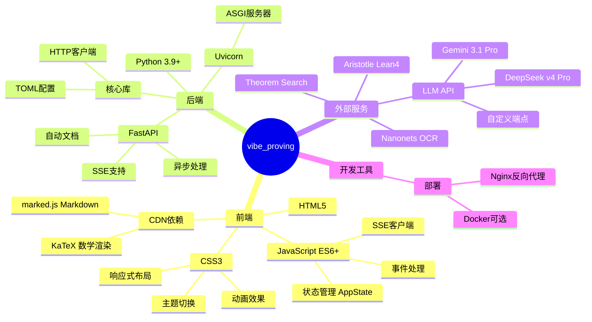

# vibe_proving 架构图 (Mermaid版本)

## 整体系统架构



## 6大功能模式流程



## 数据流与通信协议



## 前端状态管理



## 测试架构



## Learning模式详细流程



## 配置管理流程

```mermaid
flowchart LR
    subgraph "前端UI"
        Input1[输入Base URL]
        Input2[输入API Key]
        Input3[输入Model]
        SaveBtn[保存按钮]
    end
    
    subgraph "后端处理"
        Validate[验证配置]
        Write[写入config.toml]
        Reload[重新加载配置]
    end
    
    subgraph "持久化存储"
        ConfigFile[(config.toml)]
    end
    
    subgraph "验证"
        Health[/health endpoint]
        Return[返回当前配置]
    end
    
    Input1 --> SaveBtn
    Input2 --> SaveBtn
    Input3 --> SaveBtn
    SaveBtn -->|POST /config/llm| Validate
    
    Validate -->|有效| Write
    Validate -->|无效| Error1[返回错误]
    
    Write --> ConfigFile
    Write --> Reload
    
    Reload --> Success[返回成功]
    
    ConfigFile --> Health
    Health --> Return
    Return -->|显示在UI| Input1
    Return -->|显示在UI| Input2
    Return -->|显示在UI| Input3
    
    style ConfigFile fill:#f3e5f5
    style SaveBtn fill:#4caf50
    style Success fill:#4caf50
    style Error1 fill:#f44336
```

## 技术栈一览


